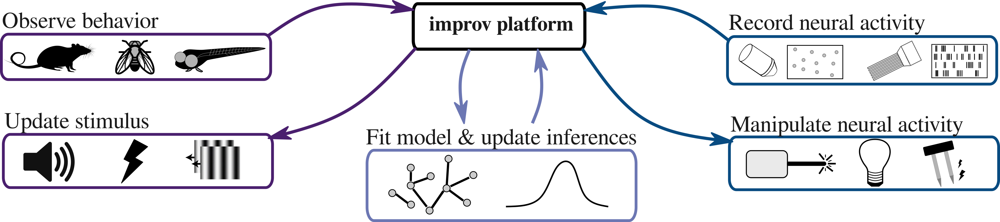

# improv
A flexible software platform for real-time and adaptive neuroscience experiments.

improv is a streaming software platform designed to enable adaptive experiments. By analyzing data, such as 2-photon calcium images, as it comes in, we can obtain information about the current brain state in real time and use it to adaptively modify an experiment as data collection is ongoing. 

This video shows raw 2-photon calcium imaging data in zebrafish, with cells detected in real time by [CaImAn](https://github.com/flatironinstitute/CaImAn), and directional tuning curves (shown as colored neurons) and functional connectivity (lines) estimated online, during a live experiment. Here only a few minutes of data have been acquired, and neurons are colored by their strongest response to visual simuli shown so far.
We also provide up-to-the-moment estimates of the functional connectivity by fitting linear-nonlinear-Poisson models online, as each new piece of data is acquired. Simple visualizations offer real-time insights, allowing for adaptive experiments that change in response to the current state of the brain.

### How improv works

improv allows users to flexibly specify and manage adaptive experiments to integrate data collection, preprocessing, visualization, and user-defined analytics. All kinds of behavioral, neural, or modeling data can be incorporated, and input and output data streams are managed independently and asynchronously. With this design, streaming analyses and real-time interventions can be easily integrated into various experimental setups. improv manages the backend engineering of data flow and task execution for all steps in an experimental pipeline in real time, without requiring user oversight. Users need only define their particular processing pipeline with simple text files and are free to define their own streaming analyses via Python classes, allowing for rapid prototyping of adaptive experiments.  
   
   
  

improv's design is based on a steamlined version of the actor model for concurrent computation. Each component of the system (experimental pipeline) is considered an 'actor' and has a unique role. They interact via message passing, without the need for a central broker. Actors are implemented as user-defined classes that inherit from improv's Actor class, which supplies all queues for message passing and orchestrates process execution and error handling. Messages between actors are composed of keys that correspond to items in a shared, in-memory data store. This both minimizes communication overhead and data copying between processes. 

## Installation

For installation instructions, please consult the [wiki](https://github.com/project-improv/improv/wiki/Installation) on our github.

### Contact
To get in touch, feel free to reach out on Twitter <a href="http://twitter.com/annedraelos" target="_blank">@annedraelos</a>. 
