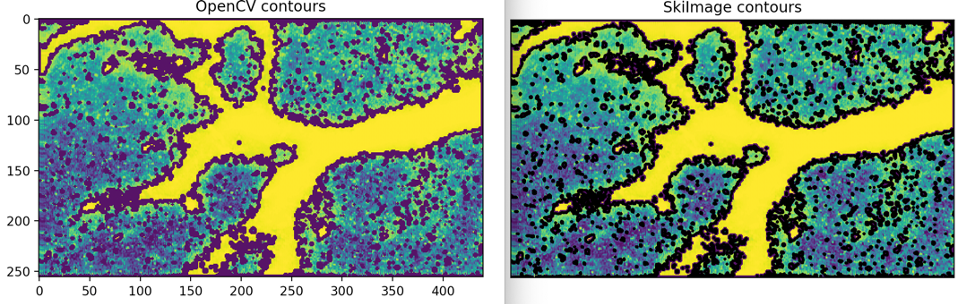
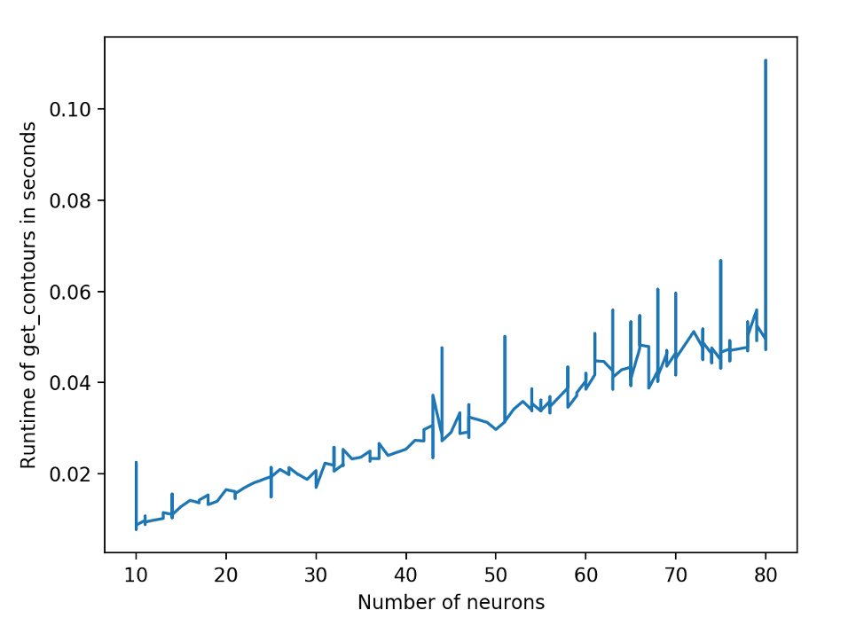

#Changes to get_contour function:

Originally, the get_contours function took about 1.03 second to run 

The parts of the function that took the most time were calculating the number of close coordinates, calculating the contours, and concatenating the arrays for the various contours together.

Initially, I realized that the close-coordinates function was taking much longer that it should be, so I decided to implement the function manually, which saved about 100 msec.

I then looked into the function that was used to calculate the contours and decided to try to implement the OpenCV findcontours function in order to get it to run more efficiently.  The images below demonstrate that despite the OpenCV function only yielding integer values, the contours still qualitatively look the same as those from the original SkiImage function.

Changing this function brought the time down by about 300 msec. The average execution time for the overall function is now about 640 msec, representing a 40% increase in efficiency.

#Changes to process:

Discovered that neurons were not updating shape after being initially added to the list of neurons. This likely indicates that once an object has broken the threshold of being classified as a neuron, there is no more new information that is acquired that would meaningfully alter the shape of the neuron.

We decided to change the updateCoords function in process so that it would only calculate new contours if there was a new neuron found or a neurons shape updated. The function would also only recalculate the contours for the neurons that were added or altered. With this update criterion, the updateCoords function took about 0.586 msec. The original function took about 4.58 msec and updating every neuron every 50 frames took 0.992 msec, so this new method for updating seems to be saving a large amount of computational time.
We also altered the get_contours function to allow the user to pass in a set of indices. The function will then only calculate new contours for the neurons with the indices passed in. 
The figure below shows a plot of number of neurons passed to get_contours and runtime. 
This plot shows that generally, runtime scales linearly with number of neurons, although there is some margin of error as can be seen in the spikes in the plot.
 

